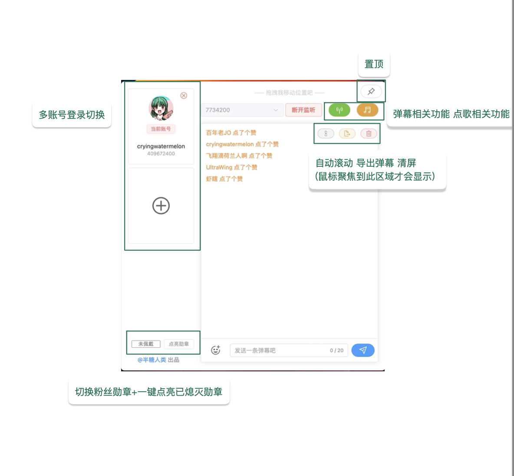
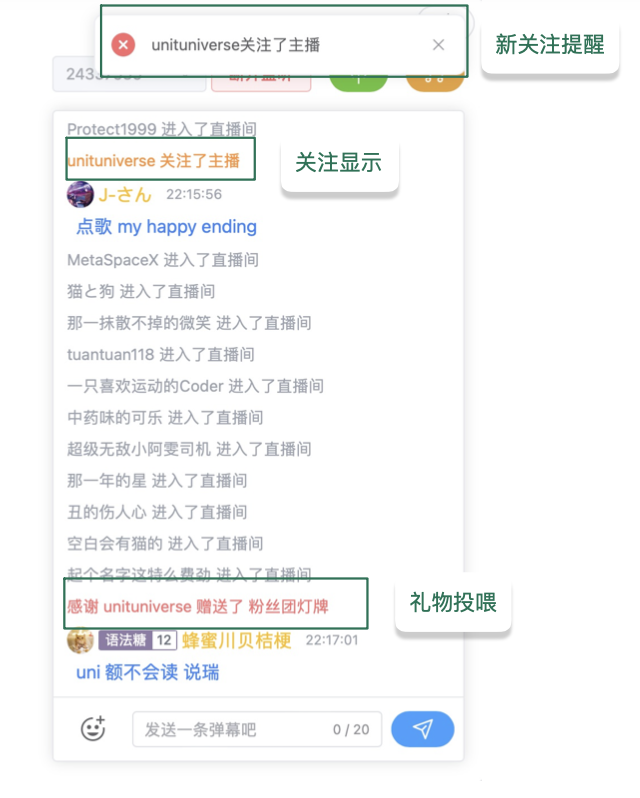
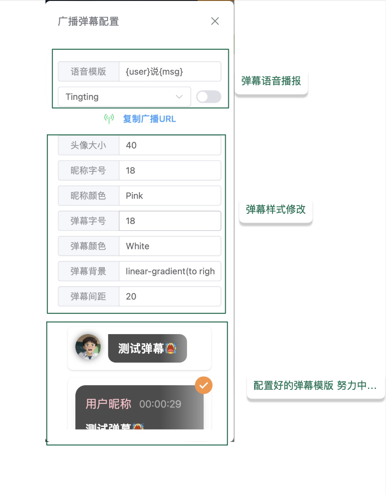
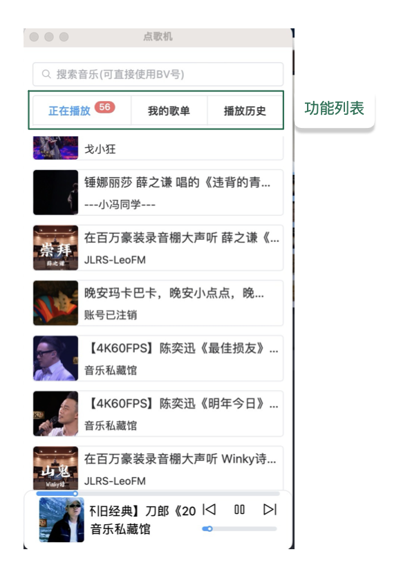
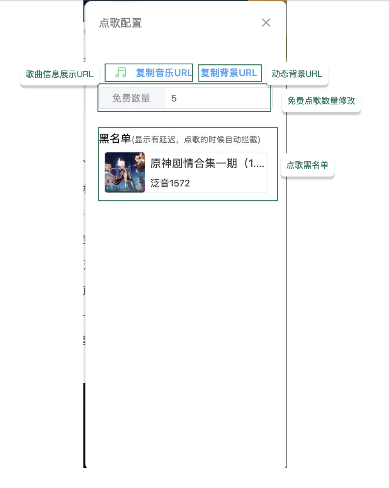
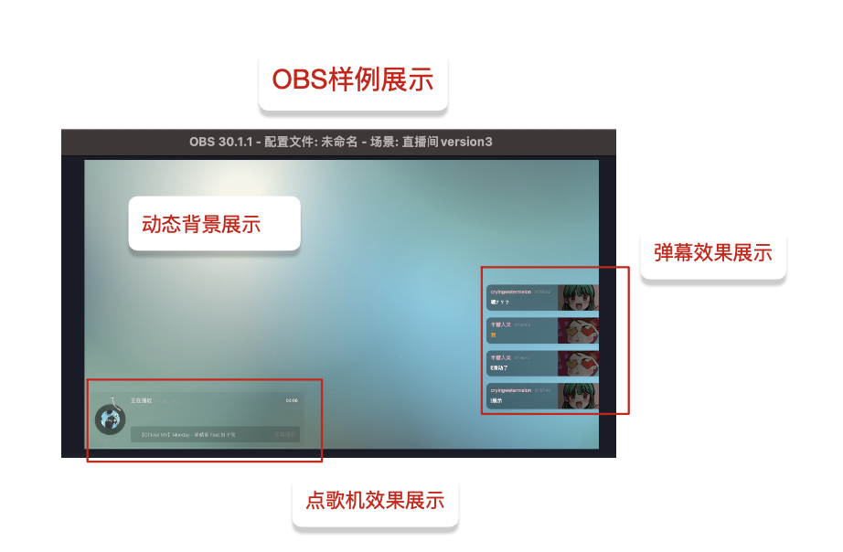

## 简介

Bili-message是一个集成弹幕显示和点歌相关功能的应用程序，功能强大，是bilibili主播不可或缺的小帮手。

希望这里的资源能够帮助您充分理解和利用bili-message。请根据指引了解详细功能，安装体验。

您可以选择在Github上提交问题以获得支持，也可以选择关注bilibili[半糖人类](https://space.bilibili.com/405579368)提交反馈和建议。

## 下载

- [Mac](https://github.com/orangelckc/bili-message/releases/latest)

- [Windows](https://github.com/orangelckc/bili-message/releases/latest)

## 功能介绍

### 登录

- 多账号登录切换
- 当前登录账号切换粉丝勋章
- 一键点亮已熄灭勋章

### 置顶

### 弹幕监听

- 监听内容

  - 指定直播间弹幕

  - 新关注提醒

  - 礼物投喂

  - 点赞

- 发送弹幕

  - 屏蔽敏感词

  - 支持发送bilibili默认文字表情包，通用表情包

  - 直播间专属表情

- 弹幕自动滚动

- 一键导出弹幕记录

- 清屏

### 广播弹幕配置

- 弹幕语音播报

  - 播报句式自定义
  - 播报语音音色切换

- 广播URL

  `提供复制广播URL将弹幕显示拓展到浏览器，obs等应用场景`

- 弹幕样式修改

  `发送弹幕用户的头像大小调节，用户昵称大小调节，用户昵称颜色调节，弹幕信息字号调节，弹幕信息颜色调节，弹幕背景调节，弹幕间距调节`

- [ ]  弹幕配置模版扩充

### 点歌配置

`提供复制音乐URL将点歌机显示拓展到浏览器，obs等应用场景`

- 歌曲信息展示URL

  `正在播放歌曲名称，封面，bv号，标题，歌曲剩余时长，即将播放歌曲列表`

- 动态背景URL

  `将当前播放歌曲提取主题色后生成的动态背景显示拓展到浏览器，obs等应用场景`

- 免费数量

  `直播间普通观众每日可点歌的数量（支持手动修改）佩戴粉丝勋章不限量点歌`

- 黑名单

### 点歌机

`弹幕输入 点歌+空格+bv号 进行精确点歌`

`弹幕输入 点歌+空格+歌名+空格+歌手 匹配检索结果中播放量最高的一首`

- 音乐搜索
- 正在播放
- 我的歌单
- 播放历史

## 展示

### 主页面

### 弹幕显示区域

  

### 广播弹幕配置界面

### 点歌机

### 点歌配置

### 样例展示

#### 本应用的最终的所有权和解释权均归orangelckc所有
